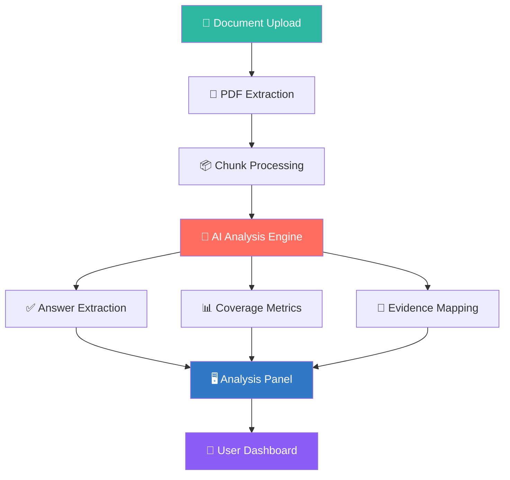

<div align="center">

# 👻 GHOSTCUT

### *Where Evidence Meets Intelligence*

[](https://react.dev)
[](https://typescriptlang.org)
[](https://tailwindcss.com)
[](#)
[](#)
[](https://anshguptaa.in)

<br/>

**🧠 AI-Powered Document Intelligence — Cut Hallucinations. Trust Evidence.**

<br/>

> 🔍 **GhostCut** is an AI-powered document compression and retrieval integrity auditing platform that eliminates hallucinations through verified, evidence-backed analysis.

---

</div>

## 🚀 What is GhostCut?

<table>
<tr>
<td width="50%">

### 🧠 The Problem
AI systems **hallucinate**. They generate plausible-sounding but fabricated answers. In legal, medical, and financial domains — this is **dangerous**.

### 💡 Our Solution
GhostCut doesn't just retrieve — it **audits, verifies, and proves** every answer with traceable evidence from source documents.

</td>
<td width="50%">

```
┌──────────────────────────┐
│   📄 Upload Document     │
│          ↓               │
│   🔪 Smart Compression   │
│          ↓               │
│   🔍 Query Analysis      │
│          ↓               │
│   ✅ Verified Answers    │
│   📊 Confidence Scores   │
│   🔗 Evidence Links      │
└──────────────────────────┘
```

</td>
</tr>
</table>

---

## ✨ Key Features

<div align="center">

| Feature | Description |
|:---:|:---|
| 📄 **Compression Studio** | Upload PDFs and compress documents into intelligent, queryable chunks |
| 🔍 **Retrieval Audit Lab** | Query documents and get AI-verified answers with full evidence trails |
| 📊 **Intelligence Dashboard** | Real-time analytics on document processing and retrieval accuracy |
| 🎯 **Answer Extraction** | Direct key-value answer extraction with confidence scoring |
| 🔗 **Evidence Linking** | Every answer links to exact Page → Line → Chunk (clickable) |
| 🧪 **Coverage Heatmap** | Dynamic token overlap, semantic similarity and span coverage metrics |
| 🛡️ **Confidence Scoring** | Match quality + source reliability + span length = trust score |
| 👻 **Ghost Mode** | AI suggestions that show what questions your document *can't* answer |

</div>

---

## 🏗️ Architecture



---

## 🛠️ Tech Stack

<div align="center">


</div>

| Layer | Technology |
|:---|:---|
| **Frontend** | React 18, TypeScript, Tailwind CSS, Framer Motion |
| **UI Components** | shadcn/ui, Radix UI Primitives |
| **State Management** | Zustand, TanStack React Query |
| **Backend** | Lovable Cloud (Edge Functions) |
| **AI Engine** | Gemini 2.5 Flash |
| **Auth** | Cloud Authentication |
| **Build** | Vite, ESLint |

---

## 🎬 How It Works

<div align="center">

```
  ┌─────────────┐     ┌─────────────┐     ┌─────────────┐
  │   UPLOAD     │────▶│  COMPRESS    │────▶│   QUERY     │
  │   📄 PDF     │     │  🔪 Chunks   │     │  🔍 Ask AI   │
  └─────────────┘     └─────────────┘     └──────┬──────┘
                                                  │
                      ┌───────────────────────────┘
                      ▼
  ┌─────────────┐     ┌─────────────┐     ┌─────────────┐
  │  EVIDENCE    │◀────│  EXTRACT    │◀────│  ANALYZE     │
  │  🔗 Linked   │     │  🎯 Answers  │     │  🧠 AI Audit │
  └─────────────┘     └─────────────┘     └─────────────┘
```

</div>

### Step-by-Step:

1. **📄 Upload** — Drop any PDF into Compression Studio
2. **🔪 Compress** — AI breaks it into smart, indexed chunks
3. **🔍 Query** — Ask natural language questions in the Retrieval Audit Lab
4. **🧠 Analyze** — AI processes with reasoning trace and evidence mapping
5. **🎯 Extract** — Get structured answers with confidence percentages
6. **🔗 Verify** — Click any answer to jump to the exact source evidence

---

## 🚀 Quick Start

```bash
# Clone the repository
git clone https://github.com/your-username/ghostcut.git

# Navigate to the project
cd ghostcut

# Install dependencies
npm install

# Start the development server
npm run dev
```

---

## 👥 Team Avengers

<div align="center">

🦸 **We are Team Avengers — Building the Future of AI Trust**

🌐 [**anshguptaa.in**](https://anshguptaa.in)

</div>

---

## 🏆 Why GhostCut Wins

<div align="center">

| ❌ Traditional RAG | ✅ GhostCut |
|:---|:---|
| Retrieves chunks, hopes for the best | **Audits every retrieval for accuracy** |
| No confidence metrics | **Real-time confidence scoring** |
| Generic summaries | **Structured answer extraction** |
| No source verification | **Clickable evidence trails** |
| Static analysis | **Dynamic coverage heatmaps** |
| Black box reasoning | **Transparent reasoning traces** |

</div>

---

<div align="center">

### 👻 *Don't just retrieve. Verify.*

<br/>

**GhostCut — Where Evidence Meets Intelligence**

Built with ❤️ by **Team Avengers** · 🌐 [anshguptaa.in](https://anshguptaa.in)

<br/>

⭐ **Star this repo if you believe AI should be trustworthy!** ⭐

</div>
