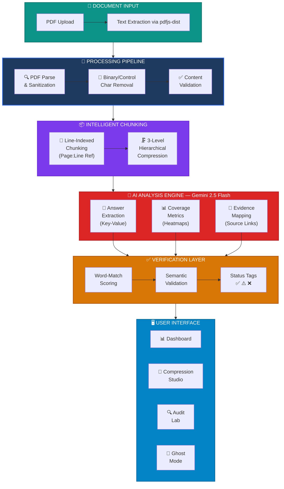

<div align="center">

# 👻 GHOSTCUT

### **Trusted Intelligence. Proven Answers.**

[](https://react.dev)
[](https://typescriptlang.org)
[](https://tailwindcss.com)
[](#)
[](#)
[](https://anshguptaa.in)
[](https://smart-document-insight.lovable.app)

<br/>

**An enterprise-grade AI document intelligence platform that eliminates hallucinations through verified, evidence-backed retrieval and contextual compression.**

🔗 **[Try the Live Demo →](https://smart-document-insight.lovable.app)**

<br/>

> 🎯 **Solving Problem Statement 3** — Retrieval Integrity &nbsp;|&nbsp; **Problem Statement 4** — Contextual Compression

---

</div>

## 🚨 The Problem

AI is **broken** — and nobody talks about it.

### Why Should You Care?

| Problem | Impact |
|:---|:---|
| 🧠 **AI Hallucinations** | Large Language Models generate confident, plausible-sounding answers — that are completely fabricated. No source. No proof. No accountability. |
| 🔍 **Broken Retrieval** | Standard RAG systems retrieve chunks of text and hope for the best. No verification. No integrity check. Garbage in, hallucination out. |
| 📦 **Lossy Compression** | When documents are compressed for AI context windows, critical details vanish — names, dates, amounts, legal clauses — gone without a trace. |
| ⚖️ **Real-World Risk** | In **legal**, **medical**, **financial**, and **compliance** domains, a single hallucinated answer can cost millions, destroy trust, or endanger lives. |

**The industry treats retrieval as a solved problem. It isn't.**

Traditional systems give you *an answer*. GhostCut gives you **a verified answer with proof.**

---

## 💡 Our Solution

GhostCut is not another chatbot. It's a **trust engine** for AI-powered document intelligence.

<div align="center">

```
  📄 Document In → 🔪 Smart Compression → 🔍 Verified Retrieval → ✅ Proven Answer Out
```

</div>

### 🔬 Five Pillars of Trusted Intelligence

| Pillar | What It Does |
|:---|:---|
| 🛡️ **Retrieval Integrity Auditor** | Every retrieved chunk is audited for relevance, accuracy, and source fidelity. Nothing slips through unverified. |
| 📦 **Contextual Compression Engine** | 3-level hierarchical compression preserves critical facts, entities, and relationships — not just keywords. |
| ✅ **Verification System** | Post-retrieval word-match and semantic validation with status badges: ✅ Verified, ⚠️ Unverified, ❌ Conflict. |
| 🔗 **Evidence Tracking** | Every answer links back to **exact Page → Line → Chunk** in the source document. Clickable. Auditable. Trustworthy. |
| 👻 **Ghost Mode** | AI-powered gap analysis that reveals what your document *can't* answer — before you make a bad decision. |

---

## ✨ Key Features

<div align="center">

| Feature | Description |
|:---:|:---|
| 📄 **Smart Compression** | 3-level hierarchical compression: Executive summary → Section synthesis → Evidence-level granularity |
| 🔍 **Evidence Search** | BM25 + vector hybrid search with entity-aware NER extraction for IDs, dates, names, amounts |
| 🛡️ **Integrity Score** | Real-time confidence scoring combining match quality, source reliability, and span coverage |
| ⭐ **Importance Highlighting** | Dynamic token overlap heatmaps with semantic similarity visualization |
| 🔐 **Secure Authentication** | Full auth system with protected routes, session management, and user-scoped data |
| 🎯 **Audit Mode** | Deep-dive retrieval audit with reasoning traces, coverage metrics, and evidence mapping |
| 📊 **Analytics Dashboard** | Real-time processing metrics, retrieval accuracy tracking, and usage analytics |
| 👻 **Ghost Mode** | Smart suggestions revealing document blind spots and unanswerable queries |

</div>

---

## 🏗️ System Architecture



---

## 🛠️ Tech Stack

<div align="center">


</div>

| Layer | Technology | Purpose |
|:---|:---|:---|
| **Frontend** | React 18, TypeScript, Tailwind CSS | Type-safe, responsive, component-driven UI |
| **Animations** | Framer Motion | Fluid transitions and micro-interactions |
| **UI System** | shadcn/ui, Radix UI | Accessible, customizable design system |
| **State** | Zustand, TanStack React Query | Lightweight global state + server-state sync |
| **Visualization** | Recharts | Interactive analytics charts and heatmaps |
| **Backend** | Edge Functions (Serverless) | Scalable, low-latency API layer |
| **AI Engine** | Google Gemini 2.5 Flash | Multi-modal reasoning and document analysis |
| **PDF Processing** | pdfjs-dist | Client-side PDF parsing and text extraction |
| **Authentication** | Cloud Auth | Secure session-based user management |
| **Database** | PostgreSQL (Cloud) | Persistent storage with Row-Level Security |
| **Build** | Vite, ESLint | Fast builds with strict code quality |

---

## 📸 Demo & Screenshots

<div align="center">

### 🖥️ Compression Studio
> Upload PDFs, watch AI break them into intelligent chunks with 3-level compression

`📸 /screenshots/compression-studio.png`

### 🔍 Retrieval Audit Lab
> Query documents, get verified answers with evidence trails and confidence scores

`📸 /screenshots/audit-lab.png`

### 📊 Intelligence Dashboard
> Real-time analytics on document processing, retrieval accuracy, and system health

`📸 /screenshots/dashboard.png`

### 👻 Ghost Mode
> AI reveals what your document can't answer — before you make critical decisions

`📸 /screenshots/ghost-mode.png`

</div>

---

## 🚀 Installation & Setup

```bash
# 1. Clone the repository
git clone https://github.com/your-username/ghostcut.git

# 2. Navigate to project directory
cd ghostcut

# 3. Install dependencies
npm install

# 4. Start the development server
npm run dev
```

The app will be running at `http://localhost:5173`

### Environment

GhostCut runs on cloud infrastructure — no local API keys or database setup required. Authentication, AI processing, and storage are handled automatically.

---

## 🎯 Use Cases

| Domain | Use Case | How GhostCut Helps |
|:---|:---|:---|
| 📋 **HR & Recruiting** | Resume verification | Extract and verify claims — education, experience, skills — with source evidence |
| ⚖️ **Legal** | Contract & document review | Audit clauses, identify gaps, verify terms with traceable references |
| ✈️ **Travel & Logistics** | Travel document audit | Validate booking details, PNRs, flight info with confidence scoring |
| 🔬 **Research** | Paper & report validation | Cross-reference findings, flag unsupported claims, verify citations |
| 🏢 **Enterprise** | Compliance & regulatory | Ensure document accuracy for audits with full evidence trails |
| 🏥 **Healthcare** | Medical record review | Verify patient data accuracy with source-linked evidence |

---

## 🏆 Why GhostCut is Different

<div align="center">

| | ❌ Normal Chatbots | ❌ Standard RAG | ✅ GhostCut |
|:---|:---|:---|:---|
| **Source Verification** | None | None | ✅ Every answer traced to source |
| **Confidence Scoring** | None | Basic similarity | ✅ Multi-factor integrity score |
| **Evidence Links** | None | Chunk reference | ✅ Page → Line → Chunk (clickable) |
| **Compression** | Truncation | Basic chunking | ✅ 3-level hierarchical with fact preservation |
| **Gap Analysis** | None | None | ✅ Ghost Mode reveals blind spots |
| **Audit Trail** | None | None | ✅ Full reasoning trace |
| **Verification Status** | None | None | ✅ Verified / Unverified / Conflict badges |
| **Coverage Metrics** | None | None | ✅ Dynamic heatmaps |

</div>

**Bottom line:** Chatbots guess. RAG hopes. GhostCut **proves.**

---

## 🎯 Hackathon Alignment

### ✅ Problem Statement 3 — Retrieval Integrity

> *"How do we ensure that retrieved information is accurate, relevant, and trustworthy?"*

**GhostCut's Answer:**

- 🛡️ **Post-retrieval verification layer** that validates every answer against source text
- 📊 **Confidence scoring** combining match quality, source reliability, and span coverage
- ✅ **Status badges** (Verified / Unverified / Conflict) for instant trust assessment
- 🔗 **Evidence linking** to exact page, line, and chunk in source documents
- 🧪 **Coverage heatmaps** showing token overlap and semantic similarity metrics

### ✅ Problem Statement 4 — Contextual Compression

> *"How do we compress documents without losing critical context?"*

**GhostCut's Answer:**

- 📦 **3-level hierarchical compression**: Executive → Section → Evidence granularity
- 🧠 **Cross-chunk reasoning** that merges overlapping facts across document sections
- 📋 **Fact-preserving extraction** that retains entities, dates, amounts, and relationships
- 🔍 **Line-indexed chunking** maintaining exact source references through compression
- 🗂️ **Domain-aware structuring** that auto-organizes by content type (resumes, contracts, reports)

---

## 🗺️ Future Roadmap

| Phase | Feature | Status |
|:---|:---|:---|
| **v1.1** | 🌍 Multi-language document support | 🔜 Planned |
| **v1.2** | 🔌 Enterprise REST API | 🔜 Planned |
| **v1.3** | 📈 Advanced analytics & reporting | 🔜 Planned |
| **v2.0** | 📱 Mobile application (React Native) | 📋 Roadmap |
| **v2.1** | 🔒 SOC2 compliance certification | 📋 Roadmap |
| **v2.2** | 🤝 Team collaboration & shared workspaces | 📋 Roadmap |
| **v3.0** | 🧩 Plugin marketplace for custom verification rules | 💡 Vision |

---

## 👥 Team Avengers

<div align="center">

🦸 **We are Team Avengers — Building the Future of AI Trust**

🌐 [**anshguptaa.in**](https://anshguptaa.in)

</div>

---

<div align="center">

### 👻 *Don't just retrieve. Verify.*

<br/>

**GhostCut — Trusted Intelligence. Proven Answers.**

Built with ❤️ by **Team Avengers** · 🌐 [anshguptaa.in](https://anshguptaa.in)

<br/>

⭐ **Star this repo if you believe AI should be trustworthy!** ⭐

</div>
